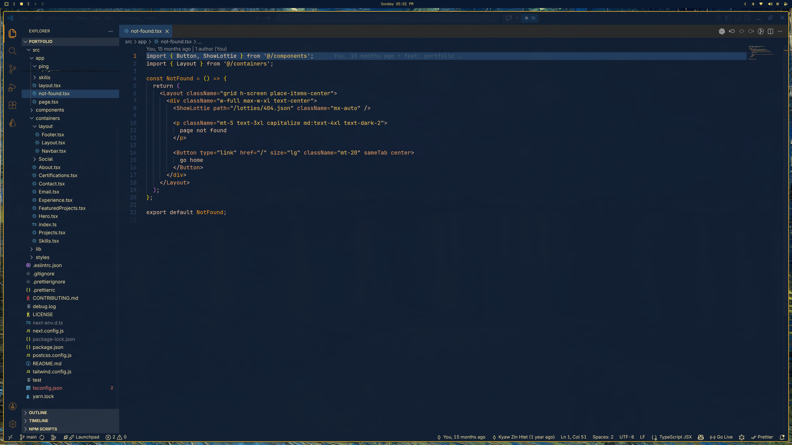

# Van Gogh Theme

[](https://marketplace.visualstudio.com/items?itemName=kyawzinhtet.van-gogh)
[](https://marketplace.visualstudio.com/items?itemName=kyawzinhtet.van-gogh)
[](https://marketplace.visualstudio.com/items?itemName=kyawzinhtet.van-gogh)
[](https://marketplace.visualstudio.com/items?itemName=kyawzinhtet.van-gogh)

A warm, artistic dark theme for **Visual Studio Code**, inspired by the colors of Van Gogh paintings and the Van Gogh Omarchy theme  
(https://github.com/Nirmal314/omarchy-van-gogh-theme).

The palette focuses on warm yellows, oranges, and deep blues to create a comfortable coding environment with strong readability.

---

## Preview



---

## Features

* Warm artistic color palette
* Designed for long coding sessions
* Clear distinction between variables, functions, and types
* Comfortable contrast for dark environments
* Consistent styling across:

  * TypeScript
  * JavaScript
  * JSON
  * HTML
  * CSS
  * Markdown
  * Terminal

---

## Color Palette

| Element              | Color     |
| -------------------- | --------- |
| Background           | `#0B1E2D` |
| Foreground           | `#F4C7A1` |
| Comments             | `#8AA1B4` |
| Keywords / Functions | `#FF9F1C` |
| Types / Classes      | `#F4A261` |
| Strings              | `#FFC857` |
| Numbers              | `#E76F51` |
| Variables            | `#FFD7A8` |

---

## Installation

### From VSIX

1. Download the `.vsix` file.
2. Open **VS Code**
3. Go to **Extensions**
4. Click `...`
5. Select **Install from VSIX**
6. Choose the file

---

### From Marketplace

Search for:

```
Van Gogh Theme
```

in the **VS Code Extensions Marketplace**.

---

## Activating the Theme

1. Open Command Palette

```
Ctrl + Shift + P
```

2. Run:

```
Preferences: Color Theme
```

3. Select:

```
Van Gogh Theme
```

---

## Recommended Font

This theme works especially well with:

* JetBrains Mono
* Fira Code
* Cascadia Code

Example settings:

```json
"editor.fontFamily": "JetBrains Mono",
"editor.fontLigatures": true
```

---

## Contributing

Issues and suggestions are welcome.

If you find any color inconsistencies or language-specific highlighting issues, feel free to open an issue.

---

## License

MIT License

---

## Author

Kyaw Zin Htet
